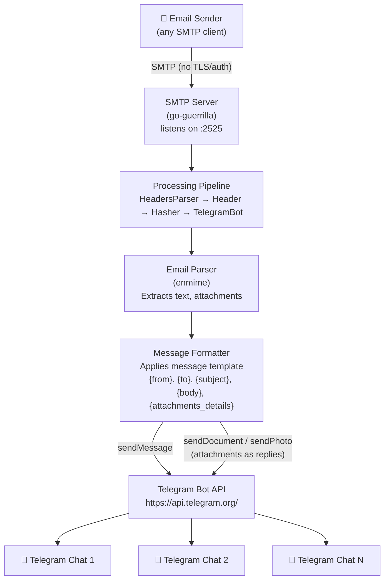

# Architecture

The following diagram describes the high-level architecture of `smtp_to_telegram`.

## Components

| Component | Description |
|---|---|
| **SMTP Server** | Listens for incoming emails (default `127.0.0.1:2525`). Implemented with [go-guerrilla](https://github.com/flashmob/go-guerrilla). No TLS or authentication required. |
| **Processing Pipeline** | go-guerrilla backend pipeline: `HeadersParser`, `Header`, `Hasher`, then the custom `TelegramBot` processor. |
| **Email Parser** | Uses [enmime](https://github.com/jhillyerd/enmime) to decode MIME messages and extract plain-text body, inline parts, and file attachments. |
| **Message Formatter** | Renders the configurable message template (`ST_TELEGRAM_MESSAGE_TEMPLATE`) with email fields. Long messages are truncated and the full text is sent as an attached file. |
| **Telegram Bot API** | The formatted message is delivered to every configured chat ID (`ST_TELEGRAM_CHAT_IDS`) via the [Telegram Bot API](https://core.telegram.org/bots/api). Images are sent with `sendPhoto`; other files with `sendDocument`, both as replies to the text message. |
